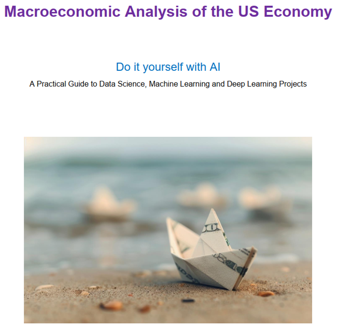

# 📘 Macroeconomic Analysis of the US Economy
Do It Yourself (DIY) with AI   => Version: 1.0, June 2025

This open-access book is designed as a practical guide for those who want to use **Artificial Intelligence (AI)** — including **Data Science**, **Machine Learning**, and **Deep Learning** — to analyze the **macroeconomic state of the US economy**.

> 🧠 From data to diagnosis — learn how to use AI to forecast, interpret, and understand economic signals.

📄 [**Download the PDF book here**](./AI-DIY-Book.pdf)

---

## ☕ Like the book? Support the author

If you found this book useful and want to support future editions:

---

## 📑 Table of Contents

- **Chapter 1**: Introduction
- **Chapter 2**: Macroeconomic Analysis of the US Economy – part 1 (Data Science project)
- **Chapter 3**: Analysis of the US Economy – part 2 (Machine Learning project)
- **Chapter 4**: Analysis of the US Economy – part 3 (Deep Learning project)
- **Chapter 5**: Appendices

---

## 🔍 About the Book

This book is an upgrade of the author's course projects on AI during 2024–2025. It covers real macroeconomic data from the **Federal Reserve (FED)**, along with custom-built models and research. The book provides reproducible AI experiments for forecasting and economic analysis with high accuracy (~95%).

**Target audience**: AI learners, researchers, economists, investors, and anyone interested in independent macroeconomic diagnostics of the US economy.

**Tools used**:
- Python (with Jupyter Notebook)
- Anaconda3 📦 Install Anaconda from: [https://www.anaconda.com/download](https://www.anaconda.com/download)
- Common ML/DL libraries (e.g., pandas, scikit-learn, keras)

📦 Install Anaconda from: [https://www.anaconda.com/download](https://www.anaconda.com/download)

---

## 📘 License and Usage

This book is officially distributed through the author's GitHub repository and other approved platforms.  
**Redistribution from unofficial sources is not permitted.**

Citation, linking, or quoting is allowed under the terms of the included [LICENSE](./LICENSE).  
If you'd like to request permission for extended use, please contact the author.

📧 Contact: **eng.vladimir.andreev@gmail.com**

---

**Created with passion. Updated with purpose. Enjoy the read — and feel free to experiment with the data!**
